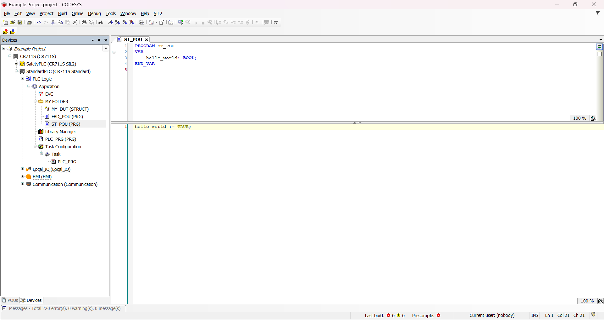
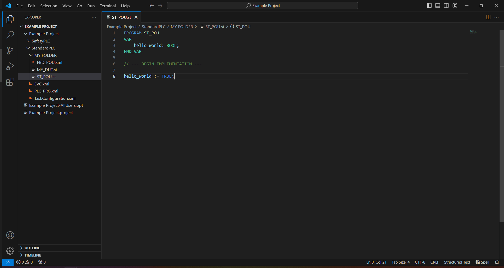
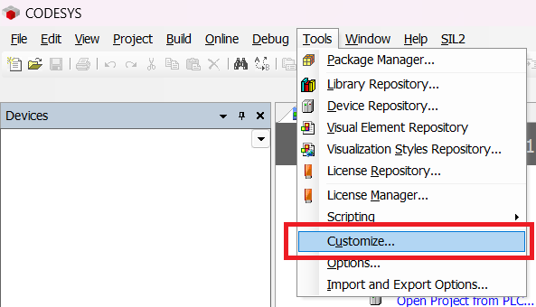
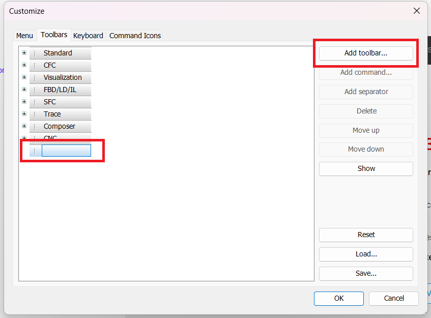
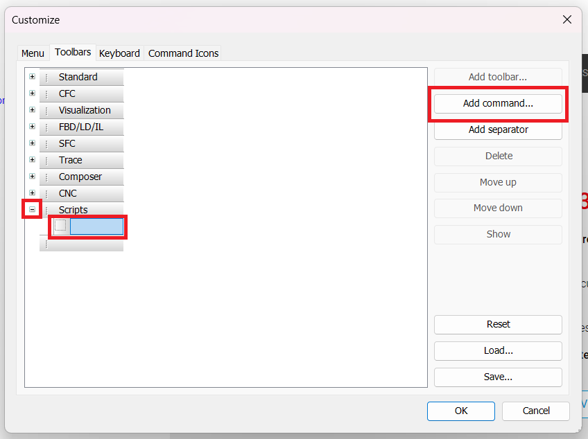
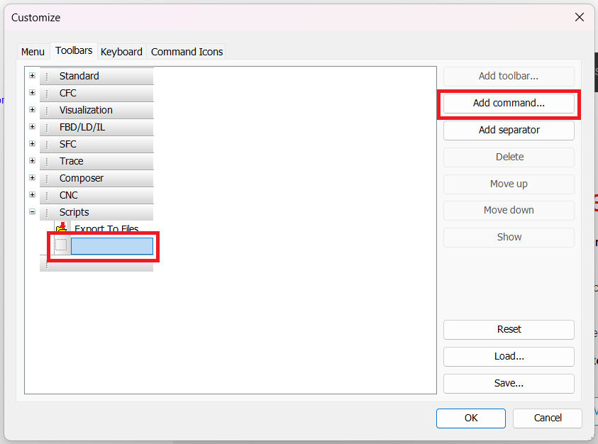

# CODESCRIBE

_/koh-DEH-skribe/_

CODESYS plaintext import and export scripts.

No python installation is required to use the scripts as CODESYS ships with its own copy of Python 2.

CODESCRIBE supplies CODESYS scripts to:
- export a project to plaintext files that can be tracked in source control, as well as edited in other editors
- import plaintext files back into a CODESYS project for uploading / debugging / etc

A CODESYS project like this:


Becomes a plaintext project like this:


The following items are exported:
- Folders
- POUs
- EVLs
- EVCs
- Task Configurations
- DUTs
- Methods
- Properties
- Actions
- Transitions

Items are exported in formatted structured text (`.st`) where possible, and in native CODESYS xml everywhere else.

The intention of CODESCRIBE is not to export a complete copy of the project, but to only export the implementation logic of the project, enabling collaboration via git and other source control methods. An empty, but configured, underlying project file should also be committed to the repo to manage any other configuration that CODESYS provides (e.g. project level configuration, device configuration).

## Status
CODESCRIBE has been tested only on CODESYS V3.5 SP11, using the project structure supplied by the IFM CR711s packages.

## Installing

### Using the install script

Using the install script requires Python 3 to be installed on your system (https://www.python.org/downloads/).

Once the repo is cloned, run `install.bat` as administrator. This will in turn run `install.py`.

Once installed, proceed to [Adding the Script Toolbar to CODESYS](#adding-the-script-toolbar-to-codesys).

### Installing manually

Copy `config.json` to `C:\<CODESYS INSTALL LOCATION>\CODESYS\Script Commands`. The `Script Commands` folder may need to be created.

Open the copy of `config.json` and edit the `"Icon"` and `"Path"` fields to point to their respective locations in cloned repo (under `src` and `icons`). For example, this config:

```json
"Icon": "export_to_files.ico",
"Path": "script_export_to_files.py",
```

Should be changed to:

```json
"Icon": "<PATH TO REPO>\\icons\\export_to_files.ico",
"Path": "<PATH TO REPO>\\src\\script_export_to_files.py",
```

_NOTE: the escaped backslashes (`\\`) are required for windows paths in json_

Once installed, proceed to [Adding the Script Toolbar to CODESYS](#adding-the-script-toolbar-to-codesys).

## Adding the Script Toolbar to CODESYS

1. Select Tools -> Customize


2. Select Toolbars


3. Select the blank toolbar at the bottom of the list and click "Add toolbar".Call it `Scripts`.


4. Expand `Scripts`, select the blank spot and click "Add command"


5. Under Categories, scroll down, select ScriptEngine Commands and pick the script you want to add
    - Scripts supplied by this repo are `Export To Files` and `Export From Files` 

    

6. Repeat the process to add the other scripts


7. Click OK to save changes


8. You should now have new icons available in your toolbar

